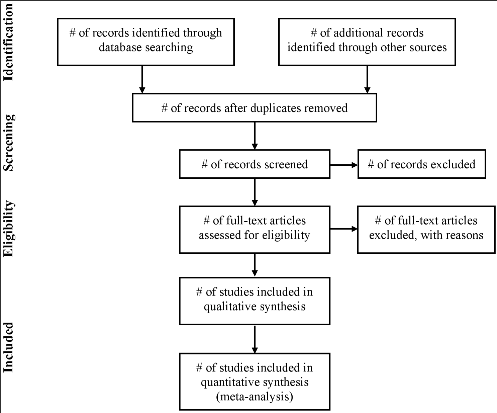
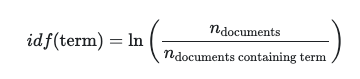
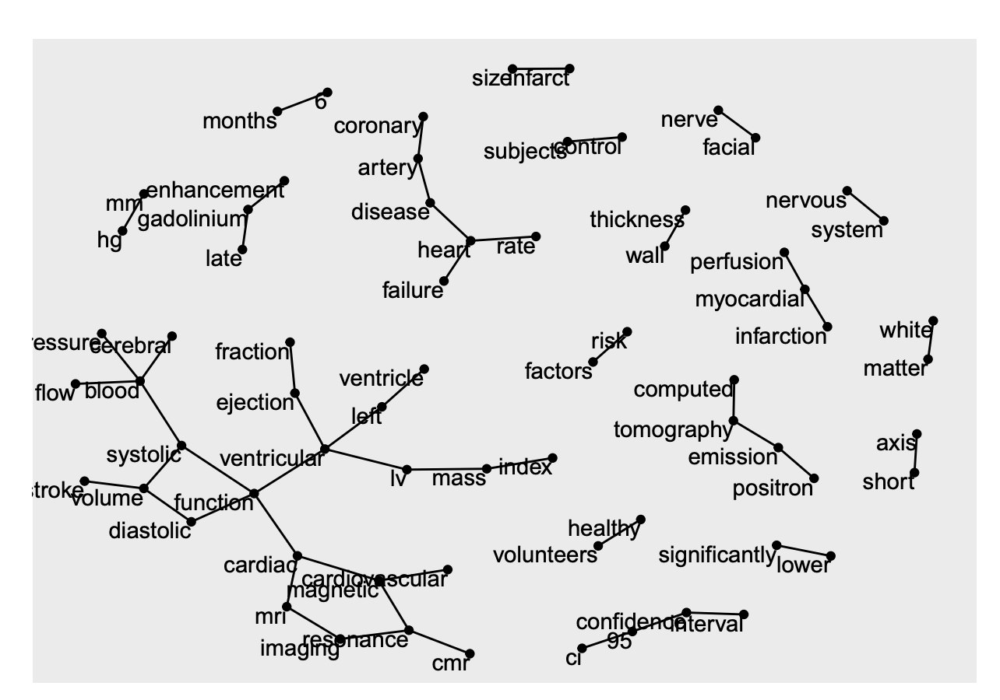
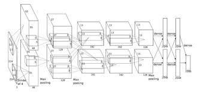
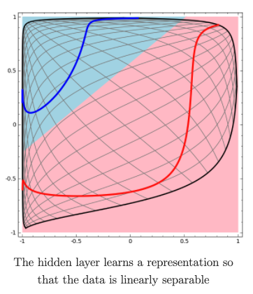
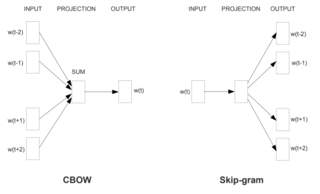
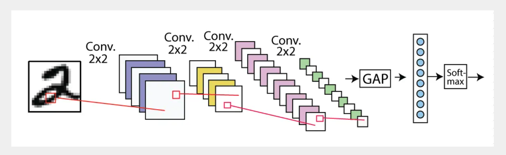
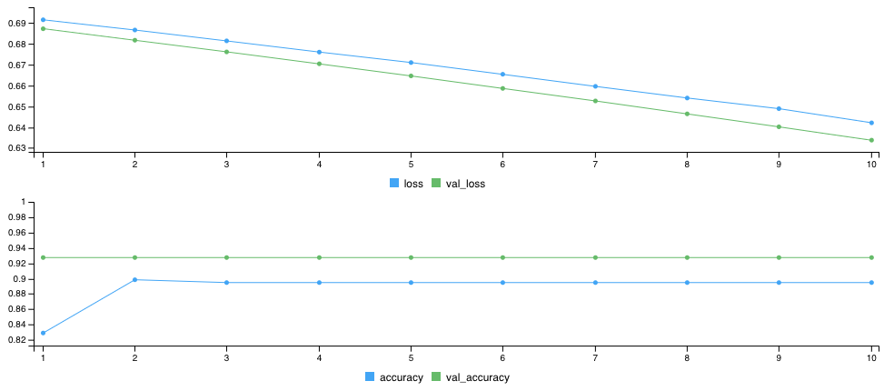
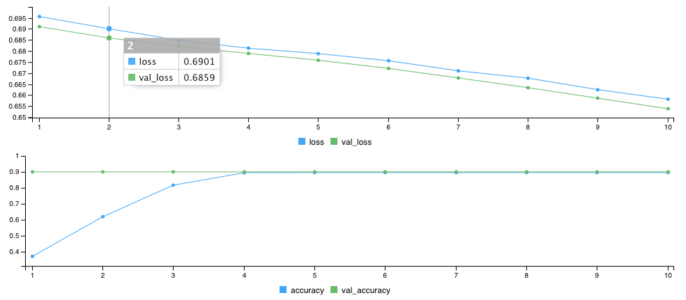
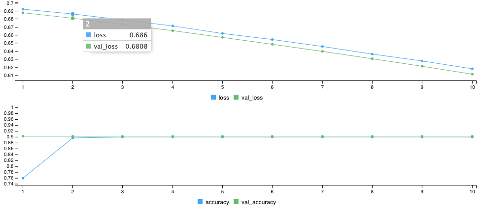

```{r setup, include=FALSE}
knitr::opts_chunk$set(echo = TRUE)
setwd('~/Desktop/finalReport/')
```

# Abstract

  The meta-analysis of neuroimaging data has proven to be a useful and meaningful tool for aggregating data across a field of study to gain insight into how human behavior relates to brain function. Although, meta-analyses are prone to limitations like any method. One flaw is closely related to the paper-selection process often conducted at the beginning of a meta-analysis. Due to the nature of database searches for journal articles, there is often a high yield of irrelevant articles that must be sorted through and excluded. This exclusion process is extremely prone to human error, as it can take months to sort through all of the articles collected after a search. In the current work, we propose a framework for eliminating this human error, by leveraging the power of supervised deep neural networks for text classification. In particular we fit a model to classify whether or not an article is relevant for the meta-analysis using a basic binary classification approach. Our model achieved a high level of accuracy in three different datasets. In conclusion, we propose a new method for the paper-selection phase of a meta-analysis.  
\newpage
# Introduction

  Meta-analyses have proven to be a useful and important tool for the field of neuroimaging. Meta-analyses have provided insight into problems ranging from aggregating data to inform what functional representations are associated with a given behavior, to providing a means of ground truth in assesing the necessary statistical power for an experimental study to detect a meaningful effect [1,2]. Despite having it's own flaws [3], the meta-analysis of nueroimaging studies has proven to be a useful and insightful tool when mapping which areas of the brain are associated with human behavior[4]. Building on the notion that meta-analyses are prone to their own flaws, it is incredibly important to develop methods that improve this process and make the results less prone to error.
  In order to conduct a meta-analysis, researchers must perform a broad search of terms associated with a specific field of study they are interested in. This search is typically performed in a publicly available database of academic research, such as Google Scholar or PubMed. Once this search is performed, it is up to the researchers to sort through the results of each search and determine if the papers are to be included in their analysis. This process is typically done by first excluding papers based on their title, without providing reasons, then exluding based on reading through the entire paper [5]. For example, if a researcher was interested in performing a meta-analysis of reinforcement learning paradigms in human neuroimaging, and a paper titled "The Hippocampus as a Predictive Map in Rats" appeared it would be excluded. This is due to the fact that the paper was not a *human* study but rather performed in *rats*. Similarly, if the paper does not have any data associated with it (i.e. a review), or is just completely unrelated to the field of interest, it will likely be excluded from the analysis. See the graphic below for the general workflow.

    This can be an incredibly tedious and error prone process, as often times the results of a search can be anywhere from 500 to 28,000 papers. A search of terms realted to autonomic activity and neuroimaging measures was recently conducted that resulted in 28,000 papers. The amount of effort and focus it takes to go through each paper title by title is immense, and extremely error prone. Thus it is incredibly important this process be assisted by automation and machine learning. Natural language processing is an excellent opportunity to achieve this, as determining exclusion/inclusion is infact a simple binary classification problem. 
    In the current database, we have a paper's title and abstract, and will use these data to train and test our model. Ideally, we would train the model on a paper's full text and other features, such as it's citation. Due to the scope of the current project I decided to stick with just the abstract and titles. 
    Before modeling our data in any way, we will need to first import it into R, clean it, and perform an exploratory data analysis to gain some insight into what our data are, and what might be the most effective way of modeling our data. So without further ado let's get into it.
    
# Exploratory Data Analysis (EDA)

  As we learned earlier in the semester, EDA is a powerful way to understand your data before modeling it in any way. EDA in this case will allow us to understand what our data are, how large they may be, and any sort of visualizations that might give us clues into how they might be behaving. But first we must read the data into our programming language of choice!! 
  
## Load data

```{r load data}
csv <- read.csv('./AMA_fulltext_and_coordinates - AMA_yes_no.csv')
head(csv)
```

Hmmm, as we mentioned we only want the title and abstract, so let's clean the data a bit to do so. There also is a couple of Ms in the Yes/No column, these are to signify Maybes. Let's change those to Ys for simplicity, if I can't decide what they are, then I would be surprised if a simple model could!

```{r clean}
dat <- csv[,c("Title","Abstract","Y.N.M")]
dat[dat$Y.N.M=='M',] <- 'Y'
head(dat)
```
  
  Great! Just what we were looking for, now we can start cleaning our data a bit more!
  
  In our case we are going to use 3 different implementations of splitting the data into test and training datasets. This is due to the fact that I am interested how model performance will differ based on recieving only the abstract, only the title, or both! So without further ado, let's create our datasets below

```{r data_prep}
abstract <- dat[,c("Abstract","Y.N.M")]
title <- dat[,c("Title","Y.N.M")]
comb <- as.data.frame(cbind(paste(dat$Title,dat$Abstract),dat$Y.N.M))
names(comb) <- c("Comb","Y.N.M")
summary(abstract)
summary(title)
summary(comb)
```

  Awesome! We now have our 3 datasets. One of the most powerful features of R, as we have learned this semester, is the `tidyverse`. I will not go into a full blown explanation of what tidy is but rather leverage the power of the tidy library specific for text analysis `tidytext` to explore our data.
  
## Toeknization and removal of stop words 

  Due to the nature of machine learning models, we will also want to perform some further cleaning on the data. As most models perform better with features that are unique to it's classification. As an example, imagine we are tying to classify a sentence on whether it is positively or negatively sentimental. If the sentence entailed: "I like the dog in the photo, he looks very friendly and I want to pet him." There are quite a few words the do not inform the sentiment of this sentence, such as "he", "to", "and", and so forth. In addition to this, we will want to treat each word in this sentence as a "token", or a feature that might inform our model. This follows the logic above, which is that by using the terms of the sentence (or tokens), we can predict something about the sentence. In this case it would be if the sentiment of the sentence is positive or negative, but in our model it would be if the abstract, title, or a combination of the two are relevant for our meta-analysis. The processes included here are called "tokenization" and removing stop words, so let's get to it! 

```{r tokenize}
# tokenize and remove stop words
library(tidytext)
library(dplyr)
tidy_abstract <- abstract %>%
  unnest_tokens(word,Abstract)%>%
  anti_join(stop_words)
tidy_title <- title %>%
  unnest_tokens(word,Title)%>%
  anti_join(stop_words)
tidy_comb <- comb %>%
  unnest_tokens(word,Comb)%>%
  anti_join(stop_words)
```
  
  Ok! This is super useful, we now have tokenized and removed stop words from abstracts, titles, and a combination of the two. There are A LOT of terms, for combination about 252211 to be exact. That's a lot of terms, how can we begin to make sense of them? Well, one way is to begin to visualize our data! 

## Visualization 

  Awesome!! Now we can begin to visualize our data a bit more. One thing that might be informative is the number of terms per dataset, and what the most frequent terms are. 

```{r eda vis}
library(ggplot2)
tidy_title%>%
  count(word,sort=T)%>%
  filter(n>100)%>%
  mutate(word=reorder(word,n))%>%
  ggplot(aes(word,n))+
  geom_col()+
  xlab(NULL)+
  coord_flip()
tidy_abstract%>%
  count(word,sort=T)%>%
  filter(n>1000)%>%
  mutate(word=reorder(word,n))%>%
  ggplot(aes(word,n))+
  geom_col()+
  xlab(NULL)+
  coord_flip()
tidy_comb%>%
  count(word,sort=T)%>%
  filter(n>1000)%>%
  mutate(word=reorder(word,n))%>%
  ggplot(aes(word,n))+
  geom_col()+
  xlab(NULL)+
  coord_flip()
```
  
  So we can see there is a bit of constancy across each, but it would be nice to get a measure of how each term relates to it's own document, AND how that term might relate to the other two! To achieve this we will use the tf-idf statistic, explained below.
  
## tf-idf

  What information does the frequency of a term in a document tell us about that document? Well it may inform us of a lot of things, and it depends on what information you are interested in! In our case, we might be interested what our document is about, as the subject of the scientific paper ultimately determines if it is relevant for a meta-analysis. Although this frequency might not be as informative as we intially think. Words like "the", "it", and other stop words are in fact quite frequent, but they don't inform us about anything as we have learned multiple times throughout the semester! So how do we solve this problem? By looking at it's compliment of course! In comes *inverse document frequency*, a measure of how "important a word is to a document in a collection or corpus of documents." See below for exactly how tf-idf is calculated! 



  In our case, a term could be one we saw in the visualization above, such as brain, and the natural log of the number of documents, divided by the number of documents containing that term. We can begin to visualize this in our data below.    

```{r tf-idf }
library(dplyr)
library(tidytext)
#get things in order
abstract$group <- rep("A",nrow(abstract))
title$group <- rep("T",nrow(title))
comb$group <- rep("C",nrow(comb))
names(abstract) <- c("text","class","group")
names(title) <- c("text","class","group")
names(comb) <- c("text","class","group")
corpus <- rbind(abstract,title,comb)
# get word count
corpus_words <- corpus %>%
  unnest_tokens(word, text) %>%
  anti_join(stop_words)%>%
  count(group, word, sort = TRUE)
#organize
plot_corpus <- corpus_words %>%
  bind_tf_idf(word, group, n) %>%
  mutate(group = factor(group, levels = c("A","T","C")))
#plot
plot_corpus %>% 
  group_by(group) %>% 
  slice_max(tf_idf, n = 15) %>% 
  ungroup() %>%
  mutate(word = reorder(word, tf_idf)) %>%
  ggplot(aes(tf_idf, word, fill = group)) +
  geom_col(show.legend = FALSE) +
  labs(x = "tf-idf", y = NULL) +
  facet_wrap(~group, ncol = 2, scales = "free")
```
  
  Ah the beauty of an alpha of .05, seems to be pretty important! I've tried to debug the super ugliness of T, but can't seem to find a solution. This is ok, as the point of visualizing these data was mainly to just get an idea of how certain terms realtes to each corpus. It is super obvious that the terms from the Abstract are dominating the tf-idf of the combination of titles and abstracts. Certainly something to keep in mind moving forward. 
    tf-idf is a useful measure, but ultimately we would like to be able to *predict* something about our text. That something is whether or not a term will inform if a document is relevant for our meta-analysis or not. But how do we begin to think about that prediction? In comes n-grams and correlations! 
    
## n-grams

  Previously we have been tokenizing our terms by single words. i.e. we unnest a corpus into it's rrspective relevant terms after removing stop words. What's a better way to go about this? MORE COWBELL. We can include 2, 3, 4, ..., n terms when choosing to unnest our data! This is typically known as n-grams, or in the case of two terms bigrams. This is EXTREMELY useful as we can begin to learn relationship between the first term and the second, or the third, and so on! We can then model the probability of term *Y* following term *X*, and if this is strongly associated with relevant papers! First we need to get into getting our bigrams, which is easily achievable by `tidytext`. Then we can get into some cool analyses, see below!! 
  
```{r bigrams}  
library(dplyr)
library(tidytext)
library(tidyr)

title_bigrams <- title %>%
  unnest_tokens(bigram, text, token = "ngrams", n = 2)%>%
  count(group,bigram,sort=T)

# filter stop words
bigram_separated <- title_bigrams%>%
  separate(bigram, c("word1", "word2"), sep = " ")

bigrams_filtered <- bigram_separated %>%
  filter(!word1 %in% stop_words$word) %>%
  filter(!word2 %in% stop_words$word)

# new bigram counts:
bigram_counts <- bigrams_filtered %>% 
  count(word1, word2, sort = TRUE)

head(bigram_counts)
```
Ok! So the above is kind of a lot, but the main take away is that we have two terms for a bigram, and the current dataframe tells use how many times two words occur with each other. Note that it is bidirectional!! 1 diabetes is not the same as diabetes 1. So now let's take a look at how all of these relate to eachother in a network graph model. This will tell us how every word relates to another in some sort of arbitrary two-dimensional space. Let's only do it for our titles as well, as things get a bit complicated when the number of terms with a certain frequency is really high



GREAT! Our network looks awesome!It also looks like a brain..., these terms are a bit random which is kind of disappointing, but they are still quite informative. For instance, seeing how many terms that are associated with heart informs us how much our search was dependent on cardiac related terms. 

# Modeling

As data scientists we would like to gain insight from our data, or use our data to predict some sort of outcome from particular features we are interested in. The number of solutions to these problems are often infinite, and quite involved. We were lucky and had quite a nice dataset ready for us. I've heard from some in the field that 95% of what they do is data curation. BUT the reason they do it is so they can then model those data!! The most recent explosion of interest in data science really stems from modeling as well. Models afford us a world of insight in answering many problems, but also have their limitations.

### What models can we use? 

Well, we can certainly use any model we can successfully implement in our programming language of choice, given that model is not patented. But this is not necessarily the correct question. A better question is what model SHOULD we use?

### What model should we use?

  To answer this question we must consider the motivation behind modeling our data in the first place. We would like to classify research articles based on whether or not they are relevant for a meta-analysis. This is often referred to as a "binary" classification. A 1 could be associated with relevance and a 0 could be associated with non-relevance. This simple distinction from say a regression problem opens a world of possibilities. Many of the most popular models today are classifiers. Take ImageNet for example, often referred to as the greatest breakthrough in object recognition, it is simply just predicting what class an object within an image may belong to. 
  For our problem I will use the state-of-the-art when it comes to machine learning (ML) algorithms. Current ML models you see in the news are typically under the class of deep learning. ImageNet is a deep convolutional neural net, alphastar and alphazero are based off deep learning, and much of the current ai summer is credited to the recent revelation in deep learning. At the opposite end of the spectrum, linear methods such as support vector machines (SVMs) afford us a very interpretable understanding of what exactly our model is learning and how it is actually classifying our data. In the following section I will explain the contrast, and why we will be using deep learning instead of a SVM.
  
## From local optima to nonlinear abstractions
  
  One issue with deep learning is that it is quite difficult to understand what the model is doing. I'll explain why in a moment, but it is crucial to understand the motivation for wanting to understand what our model is doing in the first place. Models are incredibly useful for a number of reasons such as, automating human tasks, optimizing engineering problems, and even answering scientific questions. Although to implement these models in an efficient manner we must understand what this model is learning as when it fails we can quickly understand why. This is one motivation of many for understanding the inner workings of machine learning models and not allowing them to be "black boxes."
    One problem with deep learning is that it goes beyond local optima that are intuitive to the human mind. Deep learning in turn takes many, sometimes intractable, non-linear abstractions of our data to find a function that relates an input to some sort of classification. Take the architecture of ImageNet for example. Tracking how millions of images are represented at each layer of this deep convolutional neural network is nearly impossible. Despite this it still works, which is *incredibly* fascinating. This does not necessarily automatically make it a black box, as the layers are just simply mathematical operations that can be traced back to the input data. Although ,some of the representations observed after these nonlinear mathematical abstractions are quite foreign to a human mind. Take a look at the architecture of ImageNet below for a better understanding.

  Contrary to this point, there are a large class of more simple ML algorithms that follow a more linear basis. The one of most interest to me for this project is a support vector machine (SVM). The reason for this is that an SVM typically fits a linear plane that distinguishes two classes between eachother in a high dimensional space. This linear plane is highly interpretable, as it's algorithms linear nature allows us to take a look at just how each weight is being fitted and informing our model. This is extremely tractable and makes our model highly informative beyond the notion of just being useful and highly accurate in the face of unlabeled data. To further understand this problem, consider the two classifiers below.


  Each image above is an example of a linear classifier. In the first graphic, we see an SVM fitting a *hyperplane* to distinguish between two classes. In the second image, we see a neural network fitting a linear classifier to distinguish between two classes after several abstractions of the data. This is an important distinction, as it is obvious the neural network begins to abstract the data into representations not interpretable by humans. Even in the case of this simple binary linear classification we can see that the neural net has begun to represent the data in a strange nonlinear way, where as in the case of the SVM it is completely understandable to the human interpreter. 
  This is an important distinction that I think contributes greatly to our research question. We would like to both achieve high prediction accuracy AND be able to interpret what our model is doing. Thus we will create a neural network that is both powerful and interpretable. 

## Training and testing data

  When building a supervised machine learning algorithm, we need two sets of data: one for training, and one for testing. . To train our model, we will want data that also hold some sort of label, in this case it is a Y or a N (i.e. Yes or No for including in the dataset). This training phase is where the algorithm learns some sort of association between the data and their labels. Or better yet a function *g* that maps a relationship between the input data *X* and it's class *Y*. For the testing set, we will want the data to have NO labels, as we will want to see how our model performs, and if it truly learned how we would like to classify new data! The split is typically 80% training, 20% testing, and we can use a simple algorithm in r! See below for a visual representation of what we mean by this. The following tutorial was used to perform this analysis [6].

  
```{r testTrain}
library(keras)
library(dplyr)
library(ggplot2)
library(purrr)
training_id.a <- sample.int(nrow(abstract), size = nrow(abstract)*0.8)
training.a <- abstract[training_id.a,]
testing.a <- abstract[-training_id.a,]
training_id.t <- sample.int(nrow(title), size = nrow(title)*0.8)
training.t <- title[training_id.t,]
testing.t <- title[-training_id.t,]
training_id.c <- sample.int(nrow(comb), size = nrow(comb)*0.8)
training.c <- comb[training_id.c,]
testing.c <- comb[-training_id.c,]
# lets get the distribution of each
abstract$text %>% 
  strsplit(" ") %>% 
  sapply(length) %>% 
  summary()
title$text %>% 
  strsplit(" ") %>% 
  sapply(length) %>% 
  summary()
comb$text %>% 
  strsplit(" ") %>% 
  sapply(length) %>% 
  summary()
```

  Interesting, we see again that that the combination of the two datasets is very much dominated by the Abstracts. The next step is vectorizing our data. One way is to one hot encode the 10,000 most common words in our dataset. In this case, a representation [3,5] would be represented as a vector with 9,998 0 and 1s for the indexes of 3 and 5. Instead we will "pad" our vectors so they all have the same length, then we can create a tensor of shape `num_examples * max_length`. A tensor is a multidimensional array with a uniform data type. I will explain later how our model will deal with these input data. 
  
```{r tensor}
num_words <- 10000
max_length <- 50
text_vectorization.a <- layer_text_vectorization(
  max_tokens = num_words, 
  output_sequence_length = max_length, 
)
text_vectorization.t <- layer_text_vectorization(
  max_tokens = num_words, 
  output_sequence_length = max_length, 
)
text_vectorization.c <- layer_text_vectorization(
  max_tokens = num_words, 
  output_sequence_length = max_length, 
)
text_vectorization.a %>% 
  adapt(abstract$text)
text_vectorization.t %>% 
  adapt(title$text)
text_vectorization.c %>% 
  adapt(comb$text)
# lets take a look at our tensors
text_vectorization.a(matrix(abstract$text[1], ncol = 1))
text_vectorization.t(matrix(title$text[1], ncol = 1))
text_vectorization.c(matrix(comb$text[1], ncol = 1))
```
  
Wonderful! It is interesting to see each tensor has it's the same shape and datatype, but they all certainly have their own unique representations! Now let's get to our model.

## The neural net

  As we saw with the architecture of ImageNet a neural network has different layers and each has their own function. Remember that on a very macroscopic level, we are ultimately finding a function to map our input data X to our classification Y. Now, in the case of a neural net, we perform a mathematical operation at each layer that abstracts the representation of the data. The current layers we are interested in using in this model are: an embedding layer, a global average pooling layer, a fully-connected layer, and finally a densely connected layer that yields a probability calculated by sigmoid activation. Let's get into the details of each below.
  
### Embeding layer
  
  Since we're doing a NLP project let's consider this problem: our vocabulary is comprised of discrete terms, to communicate with language we need to learn a mapping from this discrete space into a continuous one. The reason for this is that a continuous space will allow us as humans to build mental models of the similarity between certain terms and construct sentences based off this information and other features in this space. But how do we map our discrete terms to this continuous space? In comes the embedded layer! An embedding layer will allow up to embed these discrete terms into a continuous space. See the graphic below for intuition. 

### Pooling

Pooling is a bit more intense computationally, but still feasible. Say I have a hand written number and I would like to classify what digit it may be. A feature map for each potential classification of the hand written number is computed, our global average pooling layer will compute the mean of each of these feature maps. See below, but ignore the bit about the softmax layer. 



### Fully Connected Layer and Densley Connected Layer
  
  These two layers will calculate the probability that a certain feature map fed through by the pooling layer belongs to a given classification. The way this is done is via backpropogation, which is a bit out of the scope of this class. But it is useful to mention that these two layer indeed make the final predication of what class a data point may belong to. 
  
```{r neural net}
input.a <- layer_input(shape = c(1), dtype = "string")

output.a <- input.a %>% 
  text_vectorization.a() %>% 
  layer_embedding(input_dim = num_words + 1, output_dim = 16) %>%
  layer_global_average_pooling_1d() %>%
  layer_dense(units = 16, activation = "relu") %>%
  layer_dropout(0.5) %>% 
  layer_dense(units = 1, activation = "sigmoid")

model.a <- keras_model(input.a, output.a)

input.t <- layer_input(shape = c(1), dtype = "string")

output.t <- input.t %>% 
  text_vectorization.t() %>% 
  layer_embedding(input_dim = num_words + 1, output_dim = 16) %>%
  layer_global_average_pooling_1d() %>%
  layer_dense(units = 16, activation = "relu") %>%
  layer_dropout(0.5) %>% 
  layer_dense(units = 1, activation = "sigmoid")

model.t <- keras_model(input.t, output.t)

input.c <- layer_input(shape = c(1), dtype = "string")

output.c <- input.c %>% 
  text_vectorization.c() %>% 
  layer_embedding(input_dim = num_words + 1, output_dim = 16) %>%
  layer_global_average_pooling_1d() %>%
  layer_dense(units = 16, activation = "relu") %>%
  layer_dropout(0.5) %>% 
  layer_dense(units = 1, activation = "sigmoid")

model.c <- keras_model(input.c, output.c)
```

## Cost Function

  In order to properly train our model, we need to optimize our cost function. As we learned in class a cost function and optimizer will allow our model to correct it's mistakes. In this case we will use a `binary_crossentropy` loss function, this is due to the fact that we are dealing with probabilities as or output. It will give a measure of the "distance" between the probability distribution of our ground truth and predictions. 
  
```{r cost}
model.a %>% compile(
  optimizer = 'adam',
  loss = 'binary_crossentropy',
  metrics = list('accuracy')
)
model.t %>% compile(
  optimizer = 'adam',
  loss = 'binary_crossentropy',
  metrics = list('accuracy')
)
model.c %>% compile(
  optimizer = 'adam',
  loss = 'binary_crossentropy',
  metrics = list('accuracy')
)
```

## Training our model

  Now let's train the damn thing! We will train the model for 20 epochs in mini-batches of 512 samples. This is 20 iterations over all samples in the x_train and y_train tensors. While training, monitor the model’s loss and accuracy on the 10,000 samples from the validation set:
  
```{r train}
history.a <- model.a %>% fit(
  training.a$text,
  as.numeric(training.a$class == "Y"),
  epochs = 10,
  batch_size = 512,
  validation_split = 0.2,
  verbose=2
)
history.t <- model.t %>% fit(
  training.t$text,
  as.numeric(training.t$class == "Y"),
  epochs = 10,
  batch_size = 512,
  validation_split = 0.2,
  verbose=2
)
history.c <- model.c %>% fit(
  training.c$text,
  as.numeric(training.c$class == "Y"),
  epochs = 10,
  batch_size = 512,
  validation_split = 0.2,
  verbose=2
)
```




Wonderful! These are some really nice training metrics. It seems as though our loss function is linearly decreasing which is 
nice, and our base line accuracy is reached after 2 epochs. That's a pretty good accuracy of 90%!! Now let's get some results! 

## Results

```{r results}
results.a <- model.a %>% evaluate(testing.a$text, as.numeric(testing.a$class == "Y"), verbose = 0)
results.a
results.t <- model.t %>% evaluate(testing.t$text, as.numeric(testing.t$class == "Y"), verbose = 0)
results.t
results.c <- model.c %>% evaluate(testing.c$text, as.numeric(testing.c$class == "Y"), verbose = 0)
results.c
plot(history.a)
plot(history.t)
plot(history.c)
```
Wow!! Our model actually did quite well, that is incredible! Just one of many examples of how powerful deep learning really is. It is quite interesting to see that the accuracy of our model took a slight jump after the third epoch. I am curious why this may be. But to see it level out at 90% for `comb` is quite satisfying! It also worthy to note the difference in validation and training accuracy for `abstract`. I am a bit unsure what this is caused by, but none the less these results are incredibly useful and satisfying! 

## Ablation
  
  The ablation for this study was achieved by considering all 3 different forms of datasets, and fitting models to each. 
  
# Conclusion

  In the current report, I aimed to summarize what I learned throughout this semester. Although the topics ranged quite broadly and were not specific to anyone topic we learned in class, I still feel as though I demonstrated learning from the most important lesson we could have been taught: exploring and analyzing data with an open, curious, but critical and decisive mind. I demonstrated that it was feasible to classify journal article titles, abstracts, and a combination of the two based on their relevance for a meta-analysis. The model yielded a highly accurate result that was both satisfying and initially promising. Although, it must be noted that this model was never validated on a novel dataset. For instance, if I left our the combination dataset and tested each model on it instead, this might be a less biased and more accurate measure of how generalizable the model may be. Look out for a potential publication with a similar model and data, as I hope to extend this work to something that is publishable in an academic journal. Thank you so much Kayvon and Dr. Rassai for such a great semester. Cheers! 

# References(Lit. Review)
1 - Kober H, Barrett LF, Joseph J, Bliss-Moreau E, Lindquist K, Wager TD. Functional grouping and cortical-subcortical interactions in emotion: a meta-analysis of neuroimaging studies. Neuroimage. 2008 Aug 15;42(2):998-1031. doi: 10.1016/j.neuroimage.2008.03.059. Epub 2008 Apr 11. 

2 - Wager TD, Lindquist MA, Nichols TE, Kober H, Van Snellenberg JX. Evaluating the consistency and specificity of neuroimaging data using meta-analysis. Neuroimage. 2009;45(1 Suppl):S210-S221. doi:10.1016/j.neuroimage.2008.10.061

3 - Hupé, Jean-Michel. "Statistical inferences under the Null hypothesis: common mistakes and pitfalls in neuroimaging studies." Frontiers in neuroscience 9 (2015): 18.

4 - Beissner, F., Meissner, K., Bär, K. J., & Napadow, V. (2013). The autonomic brain: an activation likelihood estimation meta-analysis for central processing of autonomic function. Journal of neuroscience, 33(25), 10503-10511.

5 - Moher, D., Liberati, A., Tetzlaff, J., Altman, D. G., & Prisma Group. (2009). Preferred reporting items for systematic reviews and meta-analyses: the PRISMA statement. PLoS med, 6(7), e1000097.

6 - https://tensorflow.rstudio.com/tutorials/beginners/basic-ml/tutorial_basic_text_classification/


