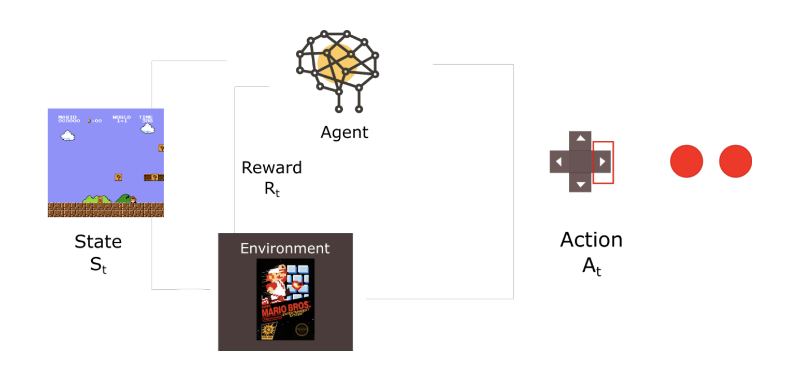

```{r setup, include=FALSE}
knitr::opts_chunk$set(echo = TRUE)
setwd("~/Desktop/report3")
```

I am taking a break from the NLP project because we're still selecting papers, and I want to start to dive into the world of reinforcement learning. So here we go. 

# The World of Reinforcement Learning. 

Last summer I approached one of the postdocs in my lab and asked if he would be my mentor for an Honor's Thesis. He gladly accepted and sent me some articles to look into to formulate some ideas. The article that was most interesting (for obvious reasons) was titled "Organizing conceptual knowledge in humans with a gridlike code" by Alexandra Constantinescu and company. The article showed that cells known to encode a map of spatial spaces are also activated when navigating conceptual spaces. Ok, that interesting and all, but how did they do it? Well it was the culmination of many years of complex modeling, neurophysiological experiments in model organisms, and fMRI experimenets in humans. 

The underlying idea that essentially acts as the conceptual grounding for this line of work is the field of computational modeling known as reinforcement learning. Reinforcement learning (RL) is a large field that encompasses many, many techniques, but can be summarized by a simple problem I will detail below. Due to the expansive amount of work done in this field, and my little knowledge, I will focus on some of the more basic ideas and implementations. With the goal of applying this modeling technique to affective neuroscience in mind. 

## The Reinforcement Learning Problem 

So in RL we typically have an agent that exists in a set of environmental states **S**, that agent interacts with the *environment* and makes a series of actions **A**, they then use this set of observations to seek a reward **R** that is to be *maximized over time*. Let's take the example of an agent playing Super Mario Bros (this example is taken from this blog post: https://medium.com/free-code-camp/an-introduction-to-reinforcement-learning-4339519de419). 

1. The Agent is in state S0, which is dependent on it's position in the environment. Or for our Agent playing Super Mario Bros, it is the first frame of the game.
2. Based on S0, the agent takes action A0. A0 can be any sort of action, in our case it will be to move to the right
3. After taking action A0 the agent transitions to the new state S1, or a new frame in the case of Super Mario
4. Upon that transition, the environment will grant some Reward R1 to the agent, such as not dying, +1 for Mario! 

Thus our RL model will always give a sequence of state, action, and reward. And the agent's overall goal will be to maximize cumulative reward. A visual graphic is presented below for better understanding. 




Because this problem is a constant loop, where each iteration starts with a change in state, we can define each iteration as **i**. Thus at each iteration the agent observes some representation of the environments state $s_{i} \in S$, thus the agent also performs an action $a_{i} \in A(s_{i})$. All those symbols are saying is that the sequence of states $S$ consists of all the states visited, $s_{i}$, while the agent is interacting with it's environment. Upon visiting state $s_{i}$, the agent takes an action $a_{i}$, which lives in the set $A(s_{i})$. The set $A(s_{i})$ is in turn **all of the possible actions** available at $s_{i}$. Thus, if we would like to consider every action avaiable at any given state we can denote $A(s_{i})$ as a subset of a larger set of every action available such that $A(s_{i}) \subseteq A$. Where A is the set of all actions available for a given agent. Upon completion of the iteration, and selection of an action. The agent then will receive some reward as discussed above, which can be denoted as $r_{i+1} \in R$, where $r_{i+1}$ is the reward relieved for a given iteration (i.e. not dying) and $R$ is the set of all rewards. 

Now, you may ask what is the point of all this? Well, there is a large body of literature that has demonstrated reinforcement learning as a potential algorithm for learning across many different contexts in both humans and animals. Although, it all nice and good that we can model how we might interact with our environment, but this does not tell us if we are **learning** anything about our environment. Thus, we must consider the problem of policy learning, in which an expected value of reward is calculated for each action associated with a given state, and the goal of the agent is to maximize that expected value and in turn learn something about it's environment to navigate it more efficiently. 

## Policy Learning

In the problem mentioned above, we can model expected value by creating a state-action function defined as $Q(s_{i},a_{i})$. This function defines the expected value associated with every action $a_{i}$ at each state $s_{i}$. This expected value function is in turn maximized by an optimal policy $\pi*(s_{i},a_{i})$, but this only the case when $Q(s_{i},a_{i})$ is known! If we know our expected value at each state, then of course our learning goal will be to learn a policy that maximizes the expected value at each state. *This is most often known as Q-learning* With this conceptual understanding under our belt, we can now progress into creating an environment and modeling an agent's interaction with said environment. 

## Installation 

We will want to install the library `ReinforcementLearning` from github using the `devtools` package

```{r install}
library(devtools)
install_github("nproellochs/ReinforcementLearning")
library("ReinforcementLearning")
```

## Problem

We would like to teach an agent to optimally move through a 2x2 grid, where each cell on the grid is a state, giving us a total of 4 states. This also means the agent can perform 4 actions at each state: up, down, left, right. Let's throw a little curve ball for the agent too, where a wall will be defined between state $s1$ and state $s4$. Our reward is defined as follow: each movement is associated with a negative reward of -1, penalizing routes that are not the shortest path. If the agent reaches it's goal state it receives a reward of 10.

### Defining the environment function

```{r environment}
# defines states and actions
states <- c("s1", "s2", "s3", "s4")
actions <- c("up", "down", "left", "right")
```

Let's write our function now! The if statements determine state and action of the agent. Thus the state refers to the position in the grid, and action describes the agent's future movement. Using this information, the function decides upon the next state and given reward. 

```{r function}
env <- gridworldEnvironment
print(env)
```

### Optimal polict

Now that we have a function associated with our environemt, let's use the `sampleExperience()` function from the RL package to get some observation sequences from the environment. As discussed above, with each iteration of an agent environment interaction, we get of sequence of: $s_{i},a_{i},r_{i+1},s_{i+1}$. Thus upon using the ``sampleExperince()` function, we will get 1000 oof these sequnces. 

```{r policy}
data <- sampleExperience(N = 1000,
                         env = env,
                         states = states,
                         actions = actions)
head(data)
```

We now have created an observation sequnce that lives in `data`. We can use these data to learn the optimal behavior! To do so we must define parameters that will then be passed into our policy. Those parameters are: the learning rate **alpha**, the discount factor **gamma**, and exploration greediness **epsilon**. Once we define these parameters we will then use the function `ReinforcementLearning` to learn an optimal policy associated with the observation set `data` 

``` {r learning}
# Define reinforcement learning parameters
control <- list(alpha = 0.1, gamma = 0.5, epsilon = 0.1)

# Perform reinforcement learning
model <- ReinforcementLearning(data, 
                               s = "State", 
                               a = "Action", 
                               r = "Reward", 
                               s_new = "NextState", 
                               control = control)
```


Now that we have kearned our policy, let's take a look at some of it's features, such as the optimal movement associated with each state. 

```{r evalualte1}
# Print policy
computePolicy(model)
```

Interesting! We also may want to know the entire table associated with each action and state (Q-value of each state-action pair)

```{r model}
print(model)
```

Great, we can see that regardless of where the agent started it learned an optimal policy to direct it to state s4. 

Let's take a look at the model summary to interpret it even a bit more. 

```{r summary}
summary(model)
```

Interesting, its clear if we look at the distribution of rewards, they are highly negative, this means the agent's policy was not all that great. In fact it was not optimal. We can update and improve a learned policy with new data samples. 

### Apply a polict to unseen data

Often when we learn something, we hope it generalizes to unseen data. Thus, we will want to see how well our agent's policy performs when it faces data it has not seen before. 

```{r unseen_data}
# Example data
data_unseen <- data.frame(State = c("s1", "s2", "s1"), 
                          stringsAsFactors = FALSE)

# Pick optimal action
data_unseen$OptimalAction <- predict(model, data_unseen$State)

data_unseen
```

After we apply a policy to the unseen data, we can then update that policy to help us improve our model and make it more generalizable. We can also control how an action is selected, in this case we will want to base it off exploration greediness, thus passing "epsilon-greeady" into the actionsSelection parameter. 

```{r new model}
# Sample N = 1000 sequences from the environment
# using epsilon-greedy action selection
data_new <- sampleExperience(N = 1000, 
                             env = env, 
                             states = states, 
                             actions = actions, 
                             actionSelection = "epsilon-greedy",
                             model = model, 
                             control = control)

# Update the existing policy using new training data
model_new <- ReinforcementLearning(data_new, 
                                   s = "State", 
                                   a = "Action", 
                                   r = "Reward", 
                                   s_new = "NextState", 
                                   control = control,
                                   model = model)
```

Lets check how our model did this time! 

```{r model_new}
print(model_new)
```

WOAH way better, look at that Reward! Nice job agent! Let's take a look at the graph to see how quickly it was able to maximize it's reward

```{r plot}
plot(model_new)
```

Interesting, quite a linear trend! Not representative of the non-linear world we live in, but still cool nonetheless! 
